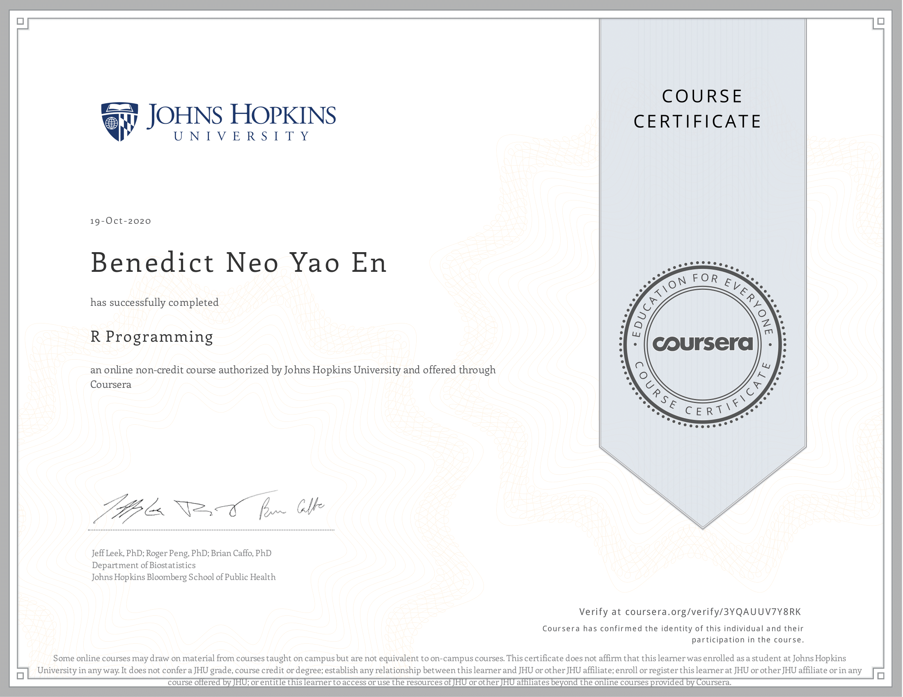

# Course Description
In this course you will learn how to program in R and how to use R for effective data analysis. You will learn how to install and configure software necessary for a statistical programming environment and describe generic programming language concepts as they are implemented in a high-level statistical language. The course covers practical issues in statistical computing which includes programming in R, reading data into R, accessing R packages, writing R functions, debugging, profiling R code, and organizing and commenting R code. Topics in statistical data analysis will provide working examples.

## Articles 

Articles are coming!

## What I've learned
I'm a beginner in Python, and this course was very beginner friendly in introducing the R programming language to me. At first the syntax was quite hard to get used to, but I found it very intuitive and easy to use afterwards, especially with the tidyverse packages. To name a few of the things I've learned that I found particularly useful - Dates and times, data manipulation w the Dplyr package, scoping rules, loop functions, regex, profiling code, simulating data, and parallel computation. The assignments were harder that I imagined and were time-intensive for me. Overall this course was quite dense and I learned a lot from it. 

## Projects

The main goal of the 3 projects were to give write functions to interact with data for various purposes, writing functions is a useful skill when working with certain tasks that aren't given in pacakges.

No | Project Title | About
--- | --- | --- 
1 | [Air Pollution](Air_pollution) | Writing functions to interact with Air pollution data
2 | [Cache Matrix](cache-matrix) | Writing a function to cache inverse of a matrix
3 | [Hospital Ranking](hospital_ranking) | Writing functions to rank hospitals by mortality rate

## Proof of completion

 

[View it online](https://coursera.org/share/ce74bc3d33b1aa8ff2f0dd7c87ea0dbb)