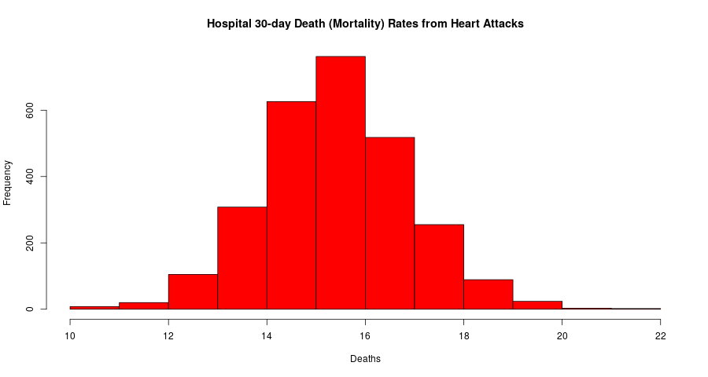

# Programming Assignment 3: Hospital Quality

## Assignment Instructions

The data for this assignment come from the Hospital Compare web site (http://hospitalcompare.hhs.gov) run by the U.S. Department of Health and Human Services. The purpose of the web site is to provide data and information about the quality of care at over 4,000 Medicare-certified hospitals in the U.S. This dataset es- sentially covers all major U.S. hospitals. This dataset is used for a variety of purposes, including determining whether hospitals should be fined for not providing high quality care to patients (see http://goo.gl/jAXFX for some background on this particular topic).

The Hospital Compare web site contains a lot of data and we will only look at a small subset for this assignment. The zip file for this assignment contains three files

* outcome-of-care-measures.csv: Contains information about 30-day mortality and readmission rates for heart attacks, heart failure, and pneumonia for over 4,000 hospitals.
* hospital-data.csv: Contains information about each hospital.
* Hospital_Revised_Flatfiles.pdf: Descriptions of the variables in each file (i.e the code book).

A description of the variables in each of the files is in the included PDF file named Hospital_Revised_Flatfiles.pdf. This document contains information about many other files that are not included with this programming assignment. You will want to focus on the variables for Number 19 (“Outcome of Care Measures.csv”) and Number 11 (“Hospital Data.csv”). You may find it useful to print out this document (at least the pages for Tables 19 and 11) to have next to you while you work on this assignment. In particular, the numbers of the variables for each table indicate column indices in each table (i.e. “Hospital Name” is column 2 in the outcome-of-care-measures.csv file)

More about the assignment here: [ProgAssignment3.pdf](https://d3c33hcgiwev3.cloudfront.net/_2a0d228f9a48b3de85eedf022225fac9_ProgAssignment3.pdf?Expires=1606176000&Signature=KBLf~IjpJrMqULXk0ZnDQUqGSkHGoMQvLubX3Uzl3U6oSwUxTc1RD-pOFR8eDEeReQtKSGjxk1IuHlnZntjJh6pyVeplbrKrcK7WiVEeU~YkXL6CF77ZCBD-8kLyhn-BSpVS1LIHOVMifaqeOLl71SckGHbWWWQ1ItFDWc-hsIk_&Key-Pair-Id=APKAJLTNE6QMUY6HBC5A)

Data zip file - [link](https://d396qusza40orc.cloudfront.net/rprog%2Fdata%2FProgAssignment3-data.zip) 

## Code 

### 1 Plot the 30-day mortality rates for heart attack - [outcome.R](https://github.com/benthecoder/JohnHopkinsDataScience/blob/main/2_Rprogramming/hospital_ranking/outcome.R) 

### 2 Finding the best hospital in a state - [best.R](https://github.com/benthecoder/JohnHopkinsDataScience/blob/main/2_Rprogramming/hospital_ranking/best.R) 

Write a function called best that take two arguments: the 2-character abbreviated name of a state and an outcome name. The function reads the outcome-of-care-measures.csv file and returns a character vector with the name of the hospital that has the best (i.e. lowest) 30-day mortality for the specified outcome in that state. The hospital name is the name provided in the Hospital.Name variable. The outcomes can be one of “heart attack”, “heart failure”, or “pneumonia”. Hospitals that do not have data on a particular outcome should be excluded from the set of hospitals when deciding the rankings.

### 3 Ranking hospitals by outcome in a state - [rankhospital.R](https://github.com/benthecoder/JohnHopkinsDataScience/blob/main/2_Rprogramming/hospital_ranking/rankhospital.R) 

Write a function called rankhospital that takes three arguments: the 2-character abbreviated name of a state (state), an outcome (outcome), and the ranking of a hospital in that state for that outcome (num). The function reads the outcome-of-care-measures.csv file and returns a character vector with the name of the hospital that has the ranking specified by the num argument. For example, the call rankhospital(“MD”, “heart failure”, 5) would return a character vector containing the name of the hospital with the 5th lowest 30-day death rate for heart failure. The num argument can take values “best”, “worst”, or an integer indicating the ranking (smaller numbers are better). If the number given by num is larger than the number of hospitals in that state, then the function should return NA. Hospitals that do not have data on a particular outcome should be excluded from the set of hospitals when deciding the rankings.

### 4 Ranking hospitals in all states - [rankall.R](https://github.com/benthecoder/JohnHopkinsDataScience/blob/main/2_Rprogramming/hospital_ranking/rankall.R) 

Write a function called rankall that takes two arguments: an outcome name (outcome) and a hospital ranking (num). The function reads the outcome-of-care-measures.csv file and returns a 2-column data frame containing the hospital in each state that has the ranking specified in num. For example the function call rankall(“heart attack”, “best”) would return a data frame containing the names of the hospitals that are the best in their respective states for 30-day heart attack death rates. The function should return a value for every state (some may be NA). The first column in the data frame is named hospital, which contains the hospital name, and the second column is named state, which contains the 2-character abbreviation for the state name. Hospitals that do not have data on a particular outcome should be excluded from the set of hospitals when deciding the rankings.

More information about the assignment [here](Hospital_Revised_Flatfiles.pdf)