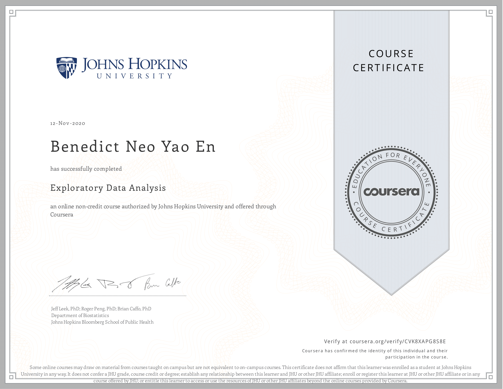

# Course Description
This course covers the essential exploratory techniques for summarizing data. These techniques are typically applied before formal modeling commences and can help inform the development of more complex statistical models. Exploratory techniques are also important for eliminating or sharpening potential hypotheses about the world that can be addressed by the data. We will cover in detail the plotting systems in R as well as some of the basic principles of constructing data graphics. We will also cover some of the common multivariate statistical techniques used to visualize high-dimensional data.

## Articles 

Articles are coming!

## What I've learned
This course was the best one yet as I got to learn about the 3 kinds of plotting system in R - base r, lattice and ggplot2. I was also given lots of insights about exploratory data analysis principles, the importance of exploratory graphs. However when Hierarchical Clustering and K-means Clustering & Dimensions Reductions was introduced, it took a considerable amount of time to understand what the code was doing. 

The main idea I took away from dimension reduction was - large data (matrix data) can be dimensionally reduced using principal component analysis and singular value decomposition to decompose the data into a smaller size, but still retaining most of the information contained in the dataset. It requires understanding of variance and covariance of data, linear algebra, and much practice for me to really appreciate what it's doing. But for now, I'm happy with what I took away from the lectures.

As for clustering, it's basically an unsupervised learning method to deal with high dimensional data and to get a quick idea of what's going on in the data set. The main diff between Hierarchical and K-means is the latter requires an advance knowldege of K (which is the no of clusters), whereas the former can stop at any number of clusters by observing the dendogram.

I also learned about working with colors in plots with the Rcolorbrewer package which I find to be very useful in presenting your plots that require accentuation of various factors.

The final project was fairly easier than the ones before, and I enjoyed going hands-on with the plotting systems, especially ggplot2 which I find more intuitive to use and cleaner.

## Book
This course is complemented with the book below

* [Exploratory Data Analysis with R - Roger D. Peng](https://bookdown.org/rdpeng/exdata/)

## Proof of completion

 

[View it online](https://coursera.org/share/36da6646e851d562299896e485303ce6)