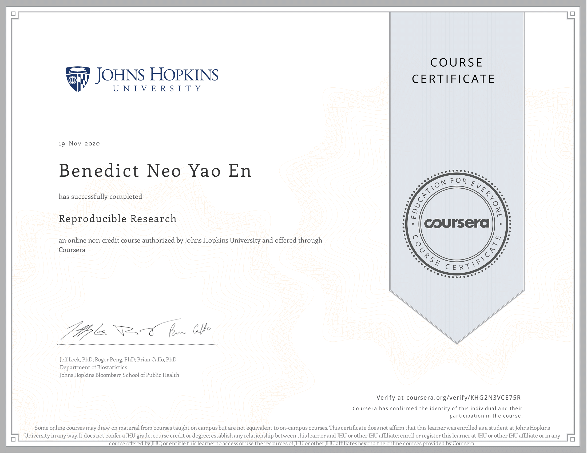

# Course Description
This course focuses on the concepts and tools behind reporting modern data analyses in a reproducible manner. Reproducible research is the idea that data analyses, and more generally, scientific claims, are published with their data and software code so that others may verify the findings and build upon them.  The need for reproducibility is increasing dramatically as data analyses become more complex, involving larger datasets and more sophisticated computations. Reproducibility allows for people to focus on the actual content of a data analysis, rather than on superficial details reported in a written summary. In addition, reproducibility makes an analysis more useful to others because the data and code that actually conducted the analysis are available. This course will focus on literate statistical analysis tools which allow one to publish data analyses in a single document that allows others to easily execute the same analysis to obtain the same results

## Articles 

Articles are coming!

## What I've learned

This course was overall the most complete one, in the sense that I got a good overarching view of what data analysis is. Based on the name of the course, you can pretty much guess that I learned a lot about what reproducible reserach is, and how it applies to data analysis as well. I was also introduced to the data science pipeline and literate(statistical) programming. 

Throughout the course, a great list for the steps in data analysis was given, and I got the opportunity to go hands-on on a data analysis project, although in terms of statisitcal modelling I am still lacking of the necessary foundation to understand it.

1. Steps in data analysis
2. Define question
3. Define ideal data set
4. Determine what data you can access
5. Obtain data
6. Clean data
7. Exploratory Data Analysis
8. Statistical Prediction/modeling
9. Interpret results
10. Challenge results
11. Synthesize/write up results
12. Create reproducible code

Towards the end, I also learned about R Markdown and using Knitr to transform them into html pages, and ultimately publish them to rpubs. I love how I was finally able to go from the groundworks of syntax, theories and concepts, and having my analysis on a web page and seeing my work gave me a sense of accomplishment. 

The course also had lectures on a Reproducible Research checklist and something called Evidence-based Data Analysis, which basically means having a standard and formalised way (based on evidence) to do data analysis. I found them not very applicable for my career path but it was good to know about it. 

As for the assignments, they were much easier as compared to the ones before, and I had fun completing them. 

## Book
This course is complemented with the book below

* [Report Writing for Data Science in R - Roger D. Peng](https://leanpub.com/reportwriting)

## Proof of completion

 

[View it online](https://coursera.org/share/82097f1d7caeadd28b22d2a7c79724ba)