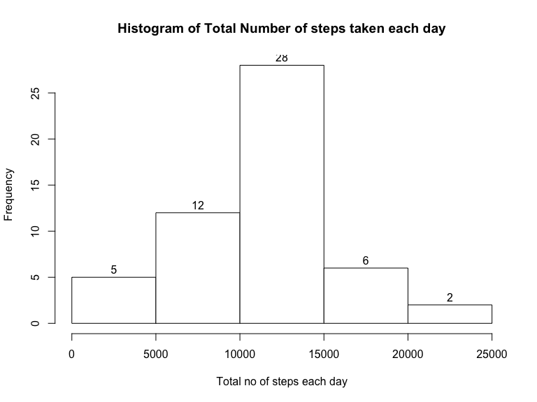
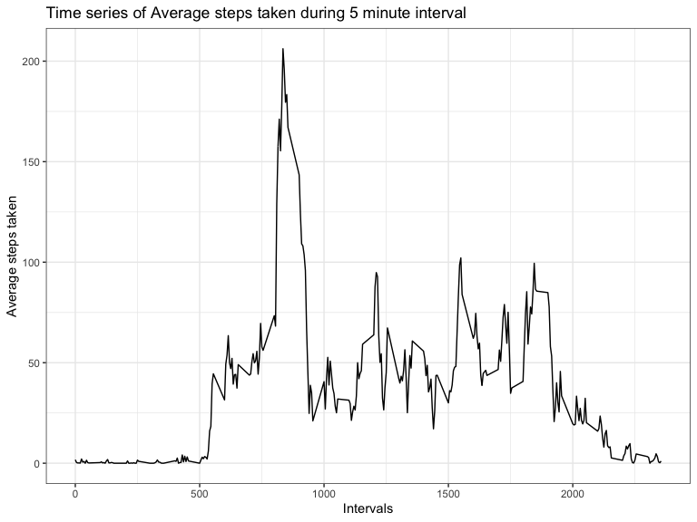
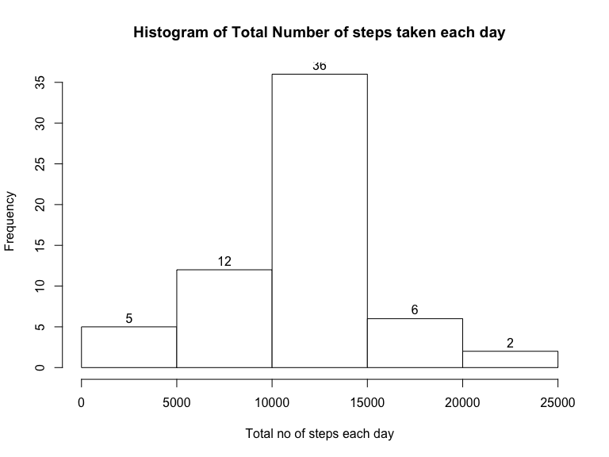

Author: Benedict Neo  
Date Created: 14th November 2020

## Loading and preprocessing the data

Loading packages I'll be using

```r
library(data.table)
library(dplyr)
library(ggplot2)
```

Load data with fread

```r
# load data into dt
dt <- data.table::fread(unzip("activity.zip"),fill=TRUE)

# Observing data
head(dt)
```

```
##    steps       date interval
## 1:    NA 2012-10-01        0
## 2:    NA 2012-10-01        5
## 3:    NA 2012-10-01       10
## 4:    NA 2012-10-01       15
## 5:    NA 2012-10-01       20
## 6:    NA 2012-10-01       25
```

```r
str(dt)
```

```
## Classes 'data.table' and 'data.frame':	17568 obs. of  3 variables:
##  $ steps   : int  NA NA NA NA NA NA NA NA NA NA ...
##  $ date    : IDate, format: "2012-10-01" "2012-10-01" ...
##  $ interval: int  0 5 10 15 20 25 30 35 40 45 ...
##  - attr(*, ".internal.selfref")=<externalptr>
```
The date variable is already a factor and the instructions allows for ignoring the 
NA values so I won't be doing anything to the data for now.

## What is mean total number of steps taken per day?

I start by grouping the data by date, and then calculating the sum of steps by
each date

```r
steps_per_day <- dt %>%
    group_by(date) %>%
    summarize(sum_steps = sum(steps),  .groups = 'drop')
```

Here's a histogram of total number of steps taken per day

```r
with(
    steps_per_day,
    hist(
        sum_steps,
        xlab = "Total no of steps each day",
        main = "Histogram of Total Number of steps taken each day",
        col = "white",
        border = "black",
        labels = TRUE
    )
)
```

<!-- -->

Using dplyr, the mean and median of steps can be calculated easily with the summarize function


```r
steps_per_day %>%
    filter(complete.cases(.)) %>%
    summarize(mean = mean(sum_steps), median = median(sum_steps))
```

```
## # A tibble: 1 x 2
##     mean median
##    <dbl>  <int>
## 1 10766.  10765
```

After removing the NA vales, which would affect the final results, the mean total number of steps is 10766.19 and the median is 10765

## What is the average daily activity pattern?

Here's a time series plot of the 5-minute interval and average number of steps taken, averaged across all days using ggplot2.

To prepare the data for the plot, the original data is grouped based on interval, then the NA values are removed, and lastly the mean of the steps is calculated.

```r
mean_interval <- dt %>% group_by(interval) %>%
    na.omit() %>%
    summarize(avg_step = mean(steps), .groups = 'drop')
```


```r
ggplot(mean_interval, aes(interval, avg_step)) +
    geom_line() +
    labs(x = "Intervals", y = "Average steps taken") +
    ggtitle("Time series of Average steps taken during 5 minute interval") +
    theme_bw()
```

<!-- -->

To find the max number of steps, the filter function is used. 


```r
mean_interval %>% filter(avg_step == max(avg_step))
```

```
## # A tibble: 1 x 2
##   interval avg_step
##      <int>    <dbl>
## 1      835     206.
```
It can be observed that the 835th 5-minute interval contains the maximum number
of steps

## Imputing missing values

To find total missing values, the `summarise_all` function from dplyr is used.


```r
dt %>% summarise_all(~sum(is.na(.)))
```

```
##   steps date interval
## 1  2304    0        0
```
By observing the result, the steps column has a total of 2304 missing values,
whereas the date and interval column has none.

To fill in the missing values, I will use a for loop to loop over all the rows,
and for the rows with missing values, I will create an index variable to
store the indexes that matches with the intervals of data table mean_interval, 
then I assign the values of average steps to the ones that are missing in my new data table

Below is the code for the strategy.


```r
# create new data table
complete_dt <- dt

# loop over all rows
for (i in 1:nrow(complete_dt)) {
    if(is.na(complete_dt$steps[i])) {
        # match indexes of new datatable interval with mean_interval
        index <- which(complete_dt$interval[i] == mean_interval$interval)
        # assign average step to NA at ith row of step column
        complete_dt$steps[i] <- mean_interval[index,]$avg_step
    }
}
```

With the new data table complete_dt, I create a new histogram. 


```r
# perform necessary transformation
hist_complete_dt <- complete_dt %>%
    group_by(date) %>%
    summarize(sum_steps = sum(steps), .groups = 'drop')
```

```r
# plot histogram
with(
    hist_complete_dt,
    hist(
        sum_steps,
        xlab = "Total no of steps each day",
        main = "Histogram of Total Number of steps taken each day",
        col = "white",
        border = "black",
        labels = TRUE
    )
)
```

<!-- -->

Then calculate the mean and median. 


```r
hist_complete_dt %>%
    summarize(mean = mean(sum_steps), median = median(sum_steps))
```

```
## # A tibble: 1 x 2
##     mean median
##    <dbl>  <dbl>
## 1 10766. 10766.
```

The mean and median calculated with the new dataset is now identical. By imputing
the averages of steps to the missing values, it caused the median to move slightly 
towards the mean, which makes sense.


## Are there differences in activity patterns between weekdays and weekends?

To factorize the date column, I decided to use the chron package, which has a useful
feature of seperating weekend from weekdays, by assigning weekends to TRUE and 
weekdays to FALSE. 


```r
library(chron) 
w_complete_dt <- complete_dt %>%
    mutate(date = chron::is.weekend(date))
```

Now to plot a new time series which makes a comparison between weekdays and weekends,
I'll be using ggplot2 again.


```r
# transforming data for plotting
w_timeseries <- w_complete_dt %>% group_by(date, interval) %>%
    summarize(avg_step = mean(steps), .groups = 'drop')

# changing labels for more appropriate names
labels <- as_labeller(c(`TRUE` = "Weekend", `FALSE` = "Weekday"))
```

```r
# plot time series with ggplot
ggplot(w_timeseries, aes(interval, avg_step, color=date)) +
    geom_line() +
    facet_wrap(~date, nrow=2, labeller= labels)+
    labs(x = "Intervals", y = "Average steps taken") +
    ggtitle("Time series of Average steps taken Weekday vs Weekend") +
    theme_bw()
```

<!-- -->

As you can see, two panels have been produced. One with weekdays and the other
weekends. A brief look at the plot, weekday has a big spike in step taken, whereas
the weekend has more steps on average. But this is still the exploratory phase and 
no strong conclusions can be made.
