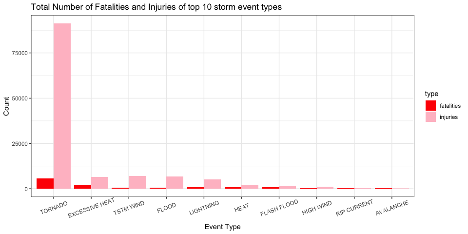
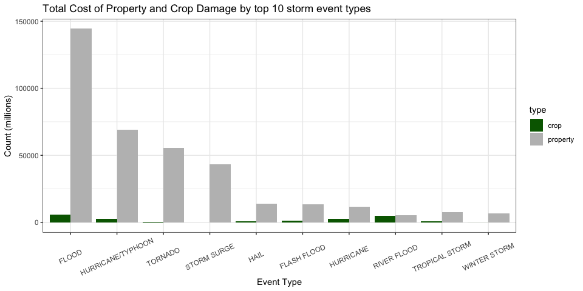

Author: Benedict Neo Yao En  
Date Created: 18th November 2020

## Introduction

Storms and other severe weather events can cause both public health and economic problems for communities and municipalities. Many severe events can result in fatalities, injuries, and property damage, and preventing such outcomes to the extent possible is a key concern.

This project involves exploring the U.S. National Oceanic and Atmospheric Administration's (NOAA) storm database. This database tracks characteristics of major storms and weather events in the United States, including when and where they occur, as well as estimates of any fatalities, injuries, and property damage.


## Data

The data for this assignment come in the form of a comma-separated-value file compressed via the bzip2 algorithm to reduce its size. You can download the file from the course web site:

* [Storm Data](https://d396qusza40orc.cloudfront.net/repdata%2Fdata%2FStormData.csv.bz2) [47Mb]

There is also some documentation of the database available. Here you will find how some of the variables are constructed/defined.

* National Weather Service [Storm Data Documentation](https://d396qusza40orc.cloudfront.net/repdata%2Fpeer2_doc%2Fpd01016005curr.pdf)
* National Climatic Data Center Storm Events [FAQ](https://d396qusza40orc.cloudfront.net/repdata%2Fpeer2_doc%2FNCDC%20Storm%20Events-FAQ%20Page.pdf)

The events in the database start in the year 1950 and end in November 2011. In the earlier years of the database there are generally fewer events recorded, most likely due to a lack of good records. More recent years should be considered more complete.

## Assignment

The basic goal of this assignment is to explore the NOAA Storm Database and answer some basic questions about severe weather events. You must use the database to answer the questions below and show the code for your entire analysis. Your analysis can consist of tables, figures, or other summaries. You may use any R package you want to support your analysis.

### Questions

Your data analysis must address the following questions:

1. Across the United States, which types of events (as indicated in the EVTYPE variable) are most harmful with respect to population health?

2. Across the United States, which types of events have the greatest economic consequences?

Consider writing your report as if it were to be read by a government or municipal manager who might be responsible for preparing for severe weather events and will need to prioritize resources for different types of events. However, there is no need to make any specific recommendations in your report.

## Software Environment information 

```r
sessionInfo()
```

```
## R version 4.0.2 (2020-06-22)
## Platform: x86_64-apple-darwin17.0 (64-bit)
## Running under: macOS  10.16
## 
## Matrix products: default
## BLAS:   /Library/Frameworks/R.framework/Versions/4.0/Resources/lib/libRblas.dylib
## LAPACK: /Library/Frameworks/R.framework/Versions/4.0/Resources/lib/libRlapack.dylib
## 
## locale:
## [1] en_US.UTF-8/en_US.UTF-8/en_US.UTF-8/C/en_US.UTF-8/en_US.UTF-8
## 
## attached base packages:
## [1] stats     graphics  grDevices utils     datasets  methods   base     
## 
## loaded via a namespace (and not attached):
##  [1] compiler_4.0.2  magrittr_1.5    tools_4.0.2     htmltools_0.5.0
##  [5] yaml_2.2.1      stringi_1.4.6   rmarkdown_2.3   knitr_1.29     
##  [9] stringr_1.4.0   xfun_0.16       digest_0.6.25   rlang_0.4.7    
## [13] evaluate_0.14
```

## Loading packages


```r
library(R.utils) # load bz2 file
library(data.table)
library(dplyr)
library(ggplot2)
library(tidyr)
```

### Download and read bz2 file

```r
if (!file.exists("stormdata.csv.bz2")) {
    url <- "https://d396qusza40orc.cloudfront.net/repdata%2Fdata%2FStormData.csv.bz2"
    download.file(url, "stormdata.csv.bz2")
    bunzip2("stormdata.csv.bz2", "stormdata.csv", remove=FALSE)
}

storm <- data.table::fread("stormdata.csv", fill=TRUE, header=TRUE)
head(storm)
```

```
##    STATE__           BGN_DATE BGN_TIME TIME_ZONE COUNTY COUNTYNAME STATE
## 1:    1.00  4/18/1950 0:00:00     0130       CST     97     MOBILE    AL
## 2:    1.00  4/18/1950 0:00:00     0145       CST      3    BALDWIN    AL
## 3:    1.00  2/20/1951 0:00:00     1600       CST     57    FAYETTE    AL
## 4:    1.00   6/8/1951 0:00:00     0900       CST     89    MADISON    AL
## 5:    1.00 11/15/1951 0:00:00     1500       CST     43    CULLMAN    AL
## 6:    1.00 11/15/1951 0:00:00     2000       CST     77 LAUDERDALE    AL
##     EVTYPE BGN_RANGE BGN_AZI BGN_LOCATI END_DATE END_TIME COUNTY_END COUNTYENDN
## 1: TORNADO         0                                               0         NA
## 2: TORNADO         0                                               0         NA
## 3: TORNADO         0                                               0         NA
## 4: TORNADO         0                                               0         NA
## 5: TORNADO         0                                               0         NA
## 6: TORNADO         0                                               0         NA
##    END_RANGE END_AZI END_LOCATI LENGTH WIDTH F MAG FATALITIES INJURIES PROPDMG
## 1:         0                      14.0   100 3   0          0       15    25.0
## 2:         0                       2.0   150 2   0          0        0     2.5
## 3:         0                       0.1   123 2   0          0        2    25.0
## 4:         0                       0.0   100 2   0          0        2     2.5
## 5:         0                       0.0   150 2   0          0        2     2.5
## 6:         0                       1.5   177 2   0          0        6     2.5
##    PROPDMGEXP CROPDMG CROPDMGEXP WFO STATEOFFIC ZONENAMES LATITUDE LONGITUDE
## 1:          K       0                                         3040      8812
## 2:          K       0                                         3042      8755
## 3:          K       0                                         3340      8742
## 4:          K       0                                         3458      8626
## 5:          K       0                                         3412      8642
## 6:          K       0                                         3450      8748
##    LATITUDE_E LONGITUDE_ REMARKS REFNUM
## 1:       3051       8806              1
## 2:          0          0              2
## 3:          0          0              3
## 4:          0          0              4
## 5:          0          0              5
## 6:          0          0              6
```
Look at column names at the data, 

```r
names(storm)
```

```
##  [1] "STATE__"    "BGN_DATE"   "BGN_TIME"   "TIME_ZONE"  "COUNTY"    
##  [6] "COUNTYNAME" "STATE"      "EVTYPE"     "BGN_RANGE"  "BGN_AZI"   
## [11] "BGN_LOCATI" "END_DATE"   "END_TIME"   "COUNTY_END" "COUNTYENDN"
## [16] "END_RANGE"  "END_AZI"    "END_LOCATI" "LENGTH"     "WIDTH"     
## [21] "F"          "MAG"        "FATALITIES" "INJURIES"   "PROPDMG"   
## [26] "PROPDMGEXP" "CROPDMG"    "CROPDMGEXP" "WFO"        "STATEOFFIC"
## [31] "ZONENAMES"  "LATITUDE"   "LONGITUDE"  "LATITUDE_E" "LONGITUDE_"
## [36] "REMARKS"    "REFNUM"
```
we see there's over 37 of variables. However, for the purpose of this analysis, we won't been needing all the columns, so I'll be using dplyr to subset them and lowercase them


```r
storm2 <- storm %>% 
  select(c("EVTYPE","FATALITIES","INJURIES","PROPDMG","PROPDMGEXP","CROPDMG","CROPDMGEXP")) %>%
  rename_all(tolower)
str(storm2)
```

```
## Classes 'data.table' and 'data.frame':	902297 obs. of  7 variables:
##  $ evtype    : chr  "TORNADO" "TORNADO" "TORNADO" "TORNADO" ...
##  $ fatalities: num  0 0 0 0 0 0 0 0 1 0 ...
##  $ injuries  : num  15 0 2 2 2 6 1 0 14 0 ...
##  $ propdmg   : num  25 2.5 25 2.5 2.5 2.5 2.5 2.5 25 25 ...
##  $ propdmgexp: chr  "K" "K" "K" "K" ...
##  $ cropdmg   : num  0 0 0 0 0 0 0 0 0 0 ...
##  $ cropdmgexp: chr  "" "" "" "" ...
##  - attr(*, ".internal.selfref")=<externalptr>
```

Based on the information above, the data table now has 902,297 rows and 7 columns. Below is a brief description of each variable.

1. evtype    : storm event type
2. fatalities: amount of fatalities per event
3. injuries  : amount of injuries per event
4. propdmg   : property damage amount
5. propdmgexp: property damage in exponents
6. cropdmg   : crop damage amount
7. cropdmgexp: crop damage in exponents

# Data Processing

### Processing data for population health analysis


```r
length(unique(storm$EVTYPE))
```

```
## [1] 985
```

First I select columns I need for the bar plot, group it by event type and calculate sum of both fatalities and injuries. Then, arrange it in descending order and slice the first 10 rows, then gather it and turning it into categorical variables for creating a grouped bar plot.


```r
pop_health <-
    storm2 %>% select(evtype, fatalities, injuries) %>% 
    group_by(evtype) %>% 
    summarize(fatalities = sum(fatalities), injuries = sum(injuries), .groups='drop') %>%
    arrange(desc(fatalities), desc(injuries)) %>%
    slice(1:10) %>% 
    gather(key = type, value = value, fatalities, injuries)
```

### Processing data for economic consequences analysis

the variable PROPDMGEXP is regarding property damage expenses, so it can be utilized to denote the events with greatest economic consequences


```r
unique(storm2$propdmgexp)
```

```
##  [1] "K" "M" ""  "B" "m" "+" "0" "5" "6" "?" "4" "2" "3" "h" "7" "H" "-" "1" "8"
```

```r
unique(storm2$cropdmgexp)
```

```
## [1] ""  "M" "K" "m" "B" "?" "0" "k" "2"
```
The values for the exponents for property and crop damage costs are messy, so I created a function to deal with that, and to calculate the cost with their respective exponent values (but in millions).


```r
# create function to calculate cost
cost <- function(x) {
  if (x == "H")
    1E-4
  else if (x == "K")
    1E-3
  else if (x == "M")
    1
  else if (x == "B")
    1E3
  else
    1-6
}
```

Aside from the function to calculate cost, the methodology is pretty much the same for the rest of the manipulation.

```r
economic <-
    storm2 %>% select("evtype", "propdmg", "propdmgexp", "cropdmg", "cropdmgexp") %>% 
    mutate(prop_dmg = propdmg*sapply(propdmgexp, FUN = cost), crop_dmg = cropdmg*sapply(cropdmgexp, FUN = cost), .keep="unused") %>%
    group_by(evtype) %>% 
    summarize(property = sum(prop_dmg), crop = sum(crop_dmg), .groups='drop') %>%
    arrange(desc(property), desc(crop)) %>%
    slice(1:10) %>% 
    gather(key = type, value = value, property, crop)
```


# Results

With the data processed and ready for creating plots, we can now answer both questions.

### 1. Across the United States, which types of events (as indicated in the EVTYPE variable) are most harmful with respect to population health?


```r
ggplot(data=pop_health, aes(reorder(evtype, -value), value, fill=type)) +
  geom_bar(position = "dodge", stat="identity") + 
  labs(x="Event Type", y="Count") +
  theme_bw() +
  theme(axis.text.x = element_text(angle = 20, vjust=0.7)) + 
  ggtitle("Total Number of Fatalities and Injuries of top 10 storm event types") +
  scale_fill_manual(values=c("red", "pink"))
```

<!-- -->

Based on the bar plot, it's evident that tornadoes have the highest impact on the popoulation health, since it causes the most fatalities and injuries.

### 2. Across the United States, which types of events have the greatest economic consequences?

```r
ggplot(data=economic, aes(reorder(evtype, -value), value, fill=type)) +
  geom_bar(position = "dodge", stat="identity") + 
  labs(x="Event Type", y="Count (millions)") +
  theme_bw() +
  theme(axis.text.x = element_text(angle = 25, vjust=0.5)) + 
  ggtitle("Total Cost of Property and Crop Damage by top 10 storm event types") +
  scale_fill_manual(values=c("darkgreen", "grey"))
```

<!-- -->

From the bar plot, Floods and Hurricanes/Typhoons have highest property and crop damage costs, thus resulting in the biggest economic consequences.

# Conclusion

Based on the analysis, resources should be directed towards dealing with tornadoes for the safety and health of population by building better infrastructure or early warning systems. As for dealing with hurricanes and typhoons, there should be more funding for innovation in developing better systems and infrastructure to safeguard these properties and crops to prevent damages as much as possible. 
