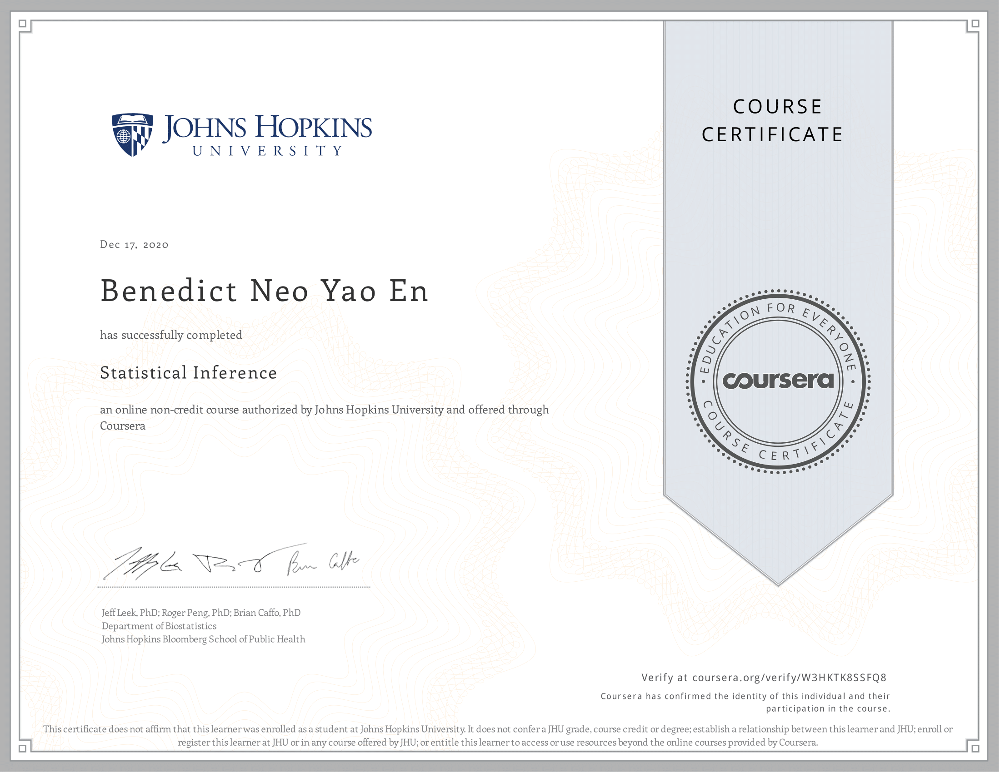

# Course Description
Statistical inference is the process of drawing conclusions about populations or scientific truths from data. There are many modes of performing inference including statistical modeling, data oriented strategies and explicit use of designs and randomization in analyses. Furthermore, there are broad theories (frequentists, Bayesian, likelihood, design based, …) and numerous complexities (missing data, observed and unobserved confounding, biases) for performing inference. A practitioner can often be left in a debilitating maze of techniques, philosophies and nuance. This course presents the fundamentals of inference in a practical approach for getting things done. After taking this course, students will understand the broad directions of statistical inference and use this information for making informed choices in analyzing data.

## Articles 

Articles are coming!

## What I've learned

Statistical inference - the process of generating conclusions about a population from a noisy sample. With it, we can gain insight into our data, and understand more about the world, allowing us to make the right decisions. 

Knowledge and [parsimony](https://www.statisticshowto.com/parsimonious-model/)(using simplest models to explain a complex phenomena), go hand in hand. We use probability models to describe the world parsimonously. This use of probability models to connect bewteen our data and the population is the most effective way to obtain inference.

The courses are defintely getting more difficult, the concepts are familiar because I've taken an Intro to stats course, but there was more depth to it. I got to understand they math behind them, and the R code as well. For some reason, R code made stats fun for me, maybe it's because I don't have to write that much on paper anymore :D.

### Week 1: 
* I learned about probabiltiy, conditional probabiltiy and expected values. It was a refresher on what I've stumbled upon before, the formulas and everything were familiar, but when it came to understanding them really well, ie. why Bayes' rule looks like that, I fall short in that aspect. I just hope I don't forget about the concepts after a few months. Using R to solve the problems was new to me, and I hope I'm able to transfer these skills in the future. 
* What was most important this week was that expected values are the properties of distribution, and the sample means (measures of center) are estimators of the population mean. And from CLT, as more data goes into sample, the more accurate is it's estimation (or more concentrated it's density function around population mean)

### Week 2: 

* I learned about variability, distribution and asymptotics. 
* Variability, it measures the spread of data. As variance increase, the tail of the distribution gets fatter and it gets further from the population mean. 
	* The square root of variance is the standard devaition, we use this because it has the same units as the population data. 
	* One important thing to note is the difference between standard dev and standard error, std talks about how variable the population is, whereas SE talks about how variable averages of random samples of size n from the population are. 
* Next is distribution, the three I learned were Binomial (0 or 1), Normal (mean 0, variance 1, the famous bell curve) and the Poisson distribution - which is used to model counts per unit of time(rates). The r codes for each of the distribution were great to know about. 
* Lastly we get to asymptotics, it is the term for the behaviour of statistics as sample size limits to infinity (spoiler alert it approaches the population statistics). It's a very important concept because it forms the basis for frequency interpretation of probabilities by considering the long run proportion of times an event occurs.
	* Two important concepts of asymptotics: Law of Large Numbers and Central Limit Theorem
	* Law of Large Numbers simply tells us that as our sample size increase (to infinity), the average of sample statistics limits to the population statistics.
	* Central Limit theorem tells us that the distribution of averages of iid variables becomes a standard normal as the sample size increase. 
* Confidence intervals were also introduced, they are used for quantifying uncertainties in our estimates, they're basically what's preventing us from getting perfect estimates. These are important later on in hypothesis testing.

### Week 3:
* T confidence intervals were introduced. 
* The main difference between t and z test is - t is used when the standard deviation is not known prior to collecting the data. If yes, we use z. If not, we use t. 
* Hypothesis testing: The famous null vs alternative hypothesis. Type I and Type II error. Alpha and power. Remember that null is assumed true and statistical evidence is required to reject it in favor of an alternative one. It's important to understand that just because we fail to reject the null, doesn't mean the null is true, it's just our evidence weren't sufficient to reject it. Everything is an assumption.
* P-values: The simplest way I define this is -> "How probable was our result based on chance?". 
* Hypothesis testing and p-values go hand in hand. We have an alpha rate, usually at 0.05. If our result wasn't less than alpha, or within the rejection region, we don't reject the null.

### Week 4:
* Week 4 was where it got interesting, I learned a ton of new things.
* Power, it's used for the purpose of designing your studies. For example you sample size for a power of 80%, you can get the sample size using `power.t.test`. 
	* To define it, it's the probability of rejecting the null when it is false. Recall that type I error is when you reject the null when it is true (alpha), and type II error is when you reject when it's false (beta). Power = 1 - beta. More power is good. 
	* power goes up when alpha, mua, n gets larger, and it's affected by the effect size (mua-mu0/sigma)
	* Power is unit free so it is interpratable across settings.
* Multiple testing
	* This covers the issue of overusing hypothesis testing producing false positives
	* To avoid it, two key components are (1)error measure, and (2)correction
	* Controlling Error Rates
		* False Positive Rate
		* Family Wise Error Rate _ uses bonferroni method (more conservative)
		* False Discovery Rate - uses BH method (less conservative, allows for more false positives)
	* Adjusting for pvalues
* Resampling
	* Boostrapping
		* super useful tool for constructing conf.int or calc SE for difficult statistics (when little data available)
		* principle: if statistics sampling distribution is unknown, use distribution defined by data and approximate it with simulation 
		* Procedure
			1. simulate n observations with replacement from observed data
			2. calculate desired statistics for each simulated data
			3. repeat above steps B times -> B simulated statistics
			4. these staitstics are drawn from sampling dist of true statistic of n observations
			5. either plot histogram / calculate sd to estimate it's SE / take quantiles (2.5 and 97.5) as conf.int
	* Permutation tests
		* compare diff groups of data and test null hypothesis that distribution of observation from each group is same
		* if true, group labels are irrelevant.
		* you're permuting labels of the group
		* recalculate statistic
		* calculate % of sim where simulated stats were more extreme (toward alternative) than observed
		* Permutation tests are the same as randomization, but with diff motivations
		* It works well for regression (by permuting regressor of interest) and in multivariate settings

### Final project review

The final project was in two parts. 

First part was about simulating sample of an exponential distribution, and then comparing it to a theoretical one. What you will find (because of CLT) is it's quite similar. 

Second part was doing a basic inferential analysis on the tooth growth data package. I had to find out whether the supplement types had a difference in tooth length. I used a basic hypothesis testing and used `t.test`. 

Overall the course was great, I learned a lot and I just hope I understood enough to be able to intuitively perform R statistical analysis well. 

## Book

* [Statistical Inference for Data Science by Brian Caffo](https://leanpub.com/LittleInferenceBook/read)

### Great summary notes from the book 

These examples illustrate many of the difficulties of trying to use data to create general conclusions about a population.

#### Paramount among our concerns are:

* Is the sample representative of the population that we’d like to draw inferences about?
* Are there known and observed, known and unobserved or unknown and unobserved variables that contaminate our conclusions?
* Is there systematic bias created by missing data or the design or conduct of the study?
* What randomness exists in the data and how do we use or adjust for it? Here randomness can either be explicit via randomization or random sampling, or implicit as the aggregation of many complex unknown processes.
* Are we trying to estimate an underlying mechanistic model of phenomena under study?

Statistical inference requires navigating the set of assumptions and tools and subsequently thinking about how to draw conclusions from data.

#### The goals of inference

You should recognize the goals of inference. Here we list five examples of inferential goals.

* Estimate and quantify the uncertainty of an estimate of a population quantity (the proportion of people who will vote for a candidate).
* Determine whether a population quantity is a benchmark value (“is the treatment effective?”).
* Infer a mechanistic relationship when quantities are measured with noise (“What is the slope for Hooke’s law?”)
* Determine the impact of a policy? (“If we reduce pollution levels, will asthma rates decline?”)
* Talk about the probability that something occurs.

#### The tools of the trade

Several tools are key to the use of statistical inference. We’ll only be able to cover a few in this class, but you should recognize them anyway.

* Randomization: concerned with balancing unobserved variables that may confound inferences of interest.
* Random sampling: concerned with obtaining data that is representative of the population of interest.
* Sampling models: concerned with creating a model for the sampling process, the most common is so called “iid”.
* Hypothesis testing: concerned with decision making in the presence of uncertainty.
* Confidence intervals: concerned with quantifying uncertainty in estimation.
* Probability models: a formal connection between the data and a population of interest. Often probability models are assumed or are approximated.
* Study design: the process of designing an experiment to minimize biases and variability.
* Nonparametric bootstrapping: the process of using the data to, with minimal probability model assumptions, create inferences.
* Permutation, randomization and exchangeability testing: the process of using data permutations to perform inferences.

#### Different thinking about probability leads to different styles of inference

We won’t spend too much time talking about this, but there are several different styles of inference. Two broad categories that get discussed a lot are:

1. Frequency probability: is the long run proportion of times an event occurs in independent, identically distributed repetitions.
2. Frequency style inference: uses frequency interpretations of probabilities to control error rates. Answers questions like “What should I decide given my data controlling the long run proportion of mistakes I make at a tolerable level.”
3. Bayesian probability: is the probability calculus of beliefs, given that beliefs follow certain rules.
4. Bayesian style inference: the use of Bayesian probability representation of beliefs to perform inference. Answers questions like “Given my subjective beliefs and the objective information from the data, what should I believe now?”

Data scientists tend to fall within shades of gray of these and various other schools of inference. Furthermore, there are so many shades of gray between the styles of inferences that it is hard to pin down most modern statisticians as either Bayesian or frequentist. In this class, we will primarily focus on basic sampling models, basic probability models and frequency style analyses to create standard inferences. This is the most popular style of inference by far.

Being data scientists, we will also consider some inferential strategies that
rely heavily on the observed data, such as permutation testing and bootstrapping. As probability modeling will be our starting point, we first build up basic probability as our first task.

Read more in the book!

## Proof of completion 

[View it online](https://coursera.org/share/f24bd532e41c87a7c5adb8302aff8aa4)
