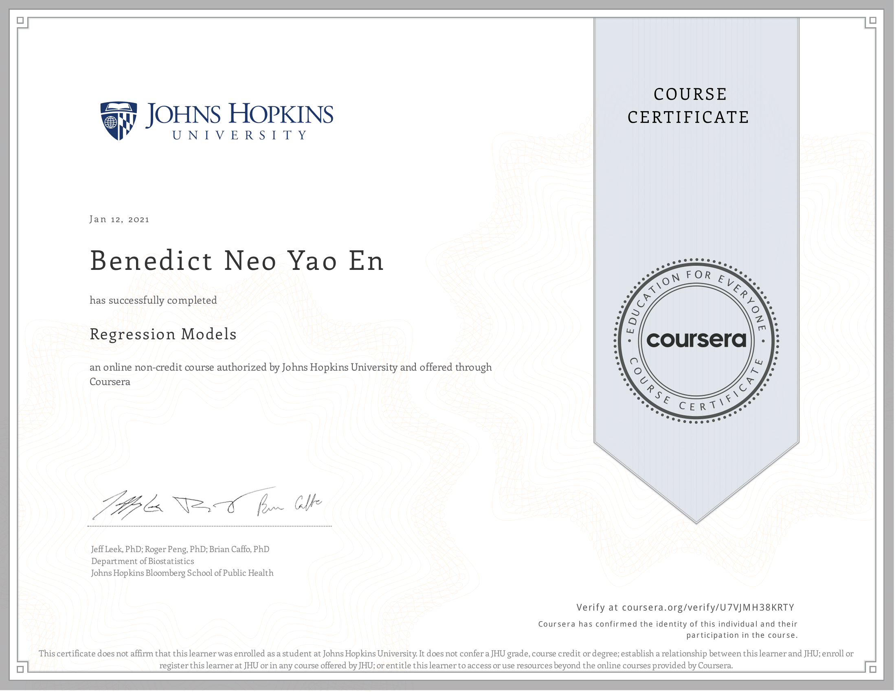

# Course Description
Linear models, as their name implies, relates an outcome to a set of predictors of interest using linear assumptions.  Regression models, a subset of linear models, are the most important statistical analysis tool in a data scientist’s toolkit. This course covers regression analysis, least squares and inference using regression models. Special cases of the regression model, ANOVA and ANCOVA will be covered as well. Analysis of residuals and variability will be investigated. The course will cover modern thinking on model selection and novel uses of regression models including scatterplot smoothing.

This class has three main components

1. Least squares and linear regression
2. Multivariable regression
3. Generalized linear models

## Articles 

Articles are coming!

## What I've learned

### Week 1
Main Concepts: Simple Linear Regression, regression thru origin, regression to the mean

The starting was good, I learned about notations and about ordinary least squares and regression through the origin. I also delved abit into regression to the mean. 

### Week 2
Main Concepts: Statistical linear models, residuals, regression inference

I learned the diff between statistical learning and machine learning, for stats learning you focus more on statistical inference concepts, like extending estimates to population and focus on explainability, whereas machine learning focus on prediction only, which makes it more of a black box. In regression inference, you look at values such as residual variation and standard error, then you get a confidence interval and use it to extend to the population. The prerequisits for this however, is that your variables have to be random IID variables (independent and identically distributed). 

### Week 3
Main concepts: Dummy variables, interactions, residuals and diagnostics, model selection

This week taught me about multivariable regression, which is using many predictor variables to predict the outcome. I saw how adding variables means each of them are adjusting for the effects of others, and how values like dffits, hatvalues, r standard, cook's distance, VIF and f-statistics all contribute to choosing good predictor variables and a good model.

### Week 4
Main concepts: GLMs, logistic regression, poisson regression, fitting functions to linear models

This week was pretty difficult, because I was introduced to a new concept which was link functions, I found them really interesting. It's basically a way to expand on the limitations of simple linear models, since you want to be able to predict outcomes that are, ie strictly positive or binary values, you're able to use link functions (logit for binary, log for poisson) to transform the parameters of your predictions, instead of the data itself. This was a really great idea and I'm glad I was introduced to this. 

### Project
The project was pretty simple, all I had to do was quantify the diference between automatic and manual transmission cars in terms of MPG. By using a boxplot to show the difference, and fitting a simple linear model to quantify the difference, also including CI for inference purposes. I also used a stepwise selection method to choose the best Multivariate Linear model that can best predict MPG. The conclusion was manual transmission cars have better fuel efficiency than automatic cars. The hard part of this project was editing and making sure everything looked nice on the report. 

## Key points

### Assumptions of linear regression:
* Linear relationship: There exists a linear relationship between the independent variable, x, and the dependent variable, y.
* Independence: The residuals are independent. In particular, there is no correlation between consecutive residuals in time series data.
* Homoscedasticity: The residuals have constant variance at every level of x.
* Normality: The residuals of the model are normally distributed.

#### Residual diagnostics terms
* dffits - change in predicted response when ith point deleted
* dfbetas - change in coefficeints when ith point deleted
* hatvalues - measures of leverage
* r standard - residuals / sd
* r student - standardized, but with ith data point deleted
* Cook's distance - overall change in coefficient when ith point deleted
* VIF - increase in variance of a coef ifdue to it's correlation with other regressors
* anova
* f statistics - ratio of SS divided by rdf. If the two scaled sums are independent and centrally chi-squared distributed with the same variance, the statistic will have an F distribution with parameters given by the two degrees of freedom.
* Shapiro-Wilk test - test residuals for normality

#### Guideline for model selection
* Be wary of simplistic rules for diagnostic plots and measures. The use of these tools is context specific. It's better to understand what they are trying to accomplish and use them judiciously.
* Not all of the measures have meaningful absolute scales. You can look at them relative to the values across the data.
* They probe your data in different ways to diagnose different problems.
* Patterns in your residual plots generally indicate some poor aspect of model fit. 
* These can include:
	* Heteroskedasticity (non constant variance).
	* Missing model terms.
	* Temporal patterns (plot residuals versus collection order).
* Residual QQ plots investigate normality of the errors.
* Leverage measures (hat values) can be useful for diagnosing data entry errors.
* Influence measures get to the bottom line, 'how does deleting or including this point impact a particular aspect of the model'.

#### 3 conditions for GLM
* exponential family model for outcome (Gaussian, Bernoulli, Poisson)
* systematic component for linear predictor (η=Xβ, where x are matrix of predictors and B are the coefficients)
* link functions that connect outcome to linear predictor
	* defined as η=g(μ), where linear predictor η is function of mean of distribution of μ

## Kaggle notebooks

### Notes
* [Week 1](https://www.kaggle.com/benthecoder/regression-models-in-r-week-1-coursera)
* [Week 2](https://www.kaggle.com/benthecoder/regression-models-in-r-week-2-coursera)
* [Week 3](https://www.kaggle.com/benthecoder/regression-models-in-r-week-3-coursera)
* [Week 4](https://www.kaggle.com/benthecoder/regression-models-in-r-week-4-coursera)

### quiz
* [Week 1](https://www.kaggle.com/benthecoder/regression-models-in-r-week-1-quiz)
* [Week 2](https://www.kaggle.com/benthecoder/regression-models-in-r-week-2-quiz)
* [Week 3](https://www.kaggle.com/benthecoder/regression-models-in-r-week-3-quiz)
* [Week 4](https://www.kaggle.com/benthecoder/regression-models-in-r-week-4-quiz)

## Book
This course is complemented with the book below

* [Regression Models for Data Science in R](https://leanpub.com/regmods/read)
* [code for book](https://github.com/gnsljw/Coursera-Data-Science-Brian-Caffo/tree/master/07_RegressionModels)

## Proof of completion

[View it online](https://coursera.org/share/f022d541561c1eb4b3398140fe3451b7)
