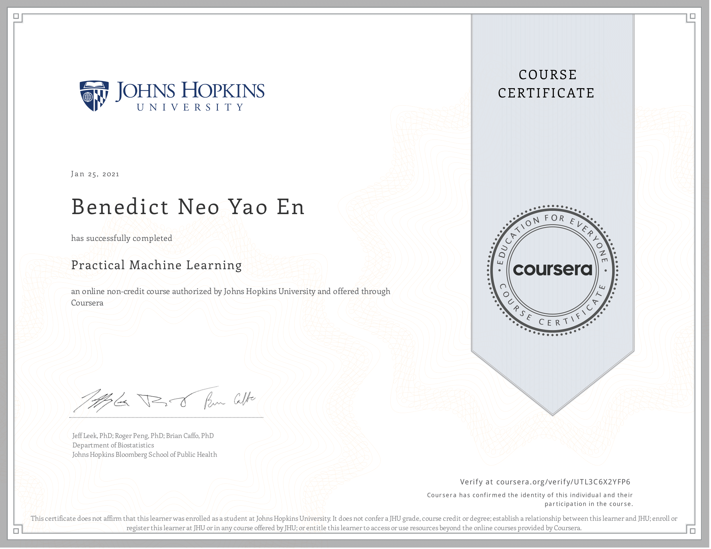

# Course Description
One of the most common tasks performed by data scientists and data analysts are prediction and machine learning. This course will cover the basic components of building and applying prediction functions with an emphasis on practical applications. The course will provide basic grounding in concepts such as training and tests sets, overfitting, and error rates. The course will also introduce a range of model based and algorithmic machine learning methods including regression, classification trees, Naive Bayes, and random forests. The course will cover the complete process of building prediction functions including data collection, feature creation, algorithms, and evaluation.

Course Content

* Prediction study design
* In sample and out of sample errors
* Overfitting
* Receiver Operating Characteristic (ROC) curves
* The caret package in R
* Preprocessing and feature creation
* Prediction with regression
* Prediction with decision trees
* Prediction with random forests
* Boosting
* Prediction blending

## Articles 

Coming soon!

## What I've learned

### Week 1
First week was great, it was a dive into what prediction is, the components, how the question is always the most important thing. Selecting the right data, features and algorithm that best fit the problem. Prediction is effectively about trade-offs, you want the right balance between interpretability, accuracy, speed, simplicity, scalability and your prediction. Interpretability is an important issue now, especially with biases and discrimination. And scalability as well, as models are all moving to the cloud. I also learned about types of errors, in and out of sample erorrs, what ROC curves are (essentially measuring quality of prediction algorithm, P(FP) on x, P(TP) on y). Also a very crucial concept I learned, cross validation, the groudnworks of many algorithms. The main idea is subsampling or bootstrapping training data and splitting into train and test multiple times. 

### Week 2 
I was introduced to the caret package. I wanted to learn about tidymodels since its newer and flashier, but I thought it was still good to know about it. Also concepts like data slicing, training options, preprocessing, plotting predictors, covaraite creation, etc. all the what nots using caret to do modelling. Overall I found caret easy to use, but the math behind the algorithm difficult, which goes to show how anyone can do ML, but not everyone understands it. I will be doing my best to learn more with the ISLR book. I also got to apply caret on regression and multiple regression. 

### Week 3 
This week was about tree based and ensemble learning. Bagging and boosting is an amazing thing. I'm stunned how old it is but still applicable today. The main idea of bagging is to reduce variance (overfitting) and boosting is to reduce bias(underfitting). Random forest is also really cool, it's a type of bagging algorithm, but with an extra step where you boostrap features to train each individual tree as well, and this makes it faster than regular bagging and more accurate as well. Random forest is pretty much all you need when you want a clasifier algorithm. I also got introducwed to model based prediction, aka generative learning. These include LInear Discriminant Analysis and Naive Bayes, theyre basically algorithm that learns how data is generated by estimating P(x|y), and then use it to estimate P(y|x) using Bayes rule. It's a lot of math, so I barely understand it, but I get the gist that it first assumes the distribution of the data, and then applies that to the prediction (which is the fundamental idea of bayesian statistics I believe)

### Week 4 
Regularized regression, the idea of making regular regression overfit less by penalizing the coefficeints that are too large. There's three types, LASSO, Ridge and Elastic Net. Lasso can shrink coefs to zero, and is good for variable selection, Ridge makes coefs smaller, and elastic net balances between small coefs and variable selection. Next up was combining predictors, which is the idea of ensemble learning, bagging, boosting and all that combines similar classifiers (trees and averages them) where as other model stacking combines different models (odd numbers so there can be majority vote). Generally combining predictors reduces your RMSE, but the drawback is it is computationally expensive duh. the lectures also briefly touched on forecasting using the quantmod package, I got to forecast the TSLA stock, and my test error was incredible high because the stock is literally off the roof. Finally, unsupervised prediciton, which is about firstly predicting labels from data, using algo like K-means, and then using those labels to predict the outcome. This can be seen in recommendation systems, where what you interact with becomes a predictor for what your preference is, which is why recommendations are specific to the person. 

### Final Project
The final project was fun, but training it defintely wasn't. My macbook air 2015 was super slow in training a random forest model. A few notes were I tried using PCA as a preprocessing for my rf model, but my accuracy decreased, I suspect it might be that losing my variables resulted in losing information needed, which is why my final model performed worse (had one classe variable predicted wrong). I removed the preprocess, trained it on 7 k-folds, and i got 100% accuracy. I would love to explore this project more using SVMs perhaps, but from what I researched, Random forest is pretty much the best in accuracy.

It was still pretty simple overall, I'm hoping to be able to do projects that are end-to-end, with multiple scripts, instead of just a notebook-type project that is useless by itself. I hope the final capstone project will give me what I want.

## Concepts Cheatsheet

Process for prediction
> population → probability and sampling to pick set of data → split into training and test set → build prediction function → predict for new data → evaluate

Components of predictor
> question → input data → features (extracting variables/characteristics) → algorithm → parameters (estimate) → evaluation

Relative Order of importance
> question (concrete/specific) > data (relevant) > features (properly extract) > algorithms

data, feature and algorithm selection
* data -> garbage in = garbage out;  more data = better models
* good features can lead to compression (PCA), automated ones might lead to instability from outliers
* algorithm ->  it doesn't matter much (complex ones yield incremental improvements), ideally it's interpretable, accurate and scalable

> predictions are effectively about trade-offs between interpretability, accuracy, speed, simplicity and scalability

In vs out of sample error
* in-sample error = error from applying model on training set
* out-of-sample error = error from applying model on test set
* generally in sample < out of sample error (models overfit to data used to train)

Sample division guide
* large sample size -> train(60)/test(20)/validation(20)
* medium -> train(60)/test(40)
* small -> no test or validation (must report caveat of no out of sample error)
* there must always be test or validation sets
* Data sets must reflect structure of problem
* subsets of data should reflect as much diversity as possible 

types of errors
* True positive
* False Positive
* True Negative
* False Negative

Error measurements
* MSE
* RMSE
* Median Absolute Deviation

Receiver Operating Characteristic Curves (ROC curve)
* used to measure quality of prediction algorithm
* Pr(FP) or 1-Specificity on X axis, Pr(TPR) or Sensitivity on Y axis
* area under curve quantifies whether prediction is viable

cross validation types
* random subsampling
* k-fold
* leave one out

Decision Trees Measures of Impurity
* misclassification error
* gini index
* deviance 
* information gai

CART
* Classification and Regression Trees (CART), commonly known as decision trees, can be represented as binary trees. They have the advantage to be very interpretable.

Random Forest
* It is a tree-based technique that uses a high number of decision trees built out of randomly selected sets of features. Contrary to the simple decision tree, it is highly uninterpretable but its generally good performance makes it a popular algorithm

Boosting
*  The idea of boosting methods is to combine several weak learners to form a
stronger one.
* types = Adaboost (high weights are put on errors to improve) and Gradient Boosting (weak learners are trained on remaining errors)

Model based prediction (Generative Learning)
* uses bayes rules to estimate data class
* Types - LDA, Naive Bayes

Model selection
* test error decrease first then increase as no of predictors increase
* goal is to avoid overfitting in training and minimize error on test
* split samples
* decompose expected prediction error
* hard thresholding for high-dimensional data (taking only subsets of predictors)
* regularization for regression
	* penalizes high coefficients  
	* ridge regression (shrinks coefficeints)
	* lasso regression (shrinks to zero and allows variable selection)

Combining Predictors (model stacking)
* ensemble methods in learning, combine classifiers by averaging
* reduces interpretability 
* two types
	* combine same classifier (bagging, boosting)
	* combine different classifier (odd number)
* the idea is to 
	1. build model
	2. take predictions on test
	3. combine in data frame with outcome (combined test)
	4. Build model based on data farme 
	5. Predict model based on combined test (combined pred test)
	5. take model 1 prediction on validation 
	6. build data frame without outcome (combined validation)
	7. Predict using model from 4 and data from 6 (combined pred val)
	8. get test errors

Forecasting
* time series data
* data is dependent over time, subsampling is more complicated
* three types
	* trend
	* seasonal
	* cyclic
* considerations for interpreting
	* unrelated time series may seem correlated
	* geographical analysis may be attributed to population distribution
	* extrapolations too far into future can be dangerous
	* depedencies over time should be examined and isolated

Unsupervised prediction
* k-means, predict labels from data
* use labels to train model
* apply model to predict outcome

## Kaggle notebooks

### Notes
* [Week 1](https://www.kaggle.com/benthecoder/practical-machine-learning-week-1)
* [Week 2](https://www.kaggle.com/benthecoder/practical-machine-learning-week-2)
* [Week 3](https://www.kaggle.com/benthecoder/practical-machine-learning-week-3)
* [Week 4](https://www.kaggle.com/benthecoder/practical-machine-learning-week-4)

### quiz
* [Week 2](https://www.kaggle.com/benthecoder/practical-machine-learning-week-2-quiz)
* [Week 3](https://www.kaggle.com/benthecoder/practical-machine-learning-week-3-quiz)
* [Week 4](https://www.kaggle.com/benthecoder/practical-machine-learning-week-4-quiz)

## Proof of completion

 

[View it online](https://coursera.org/share/07d1820dad9ad20952834ba097bed505)
