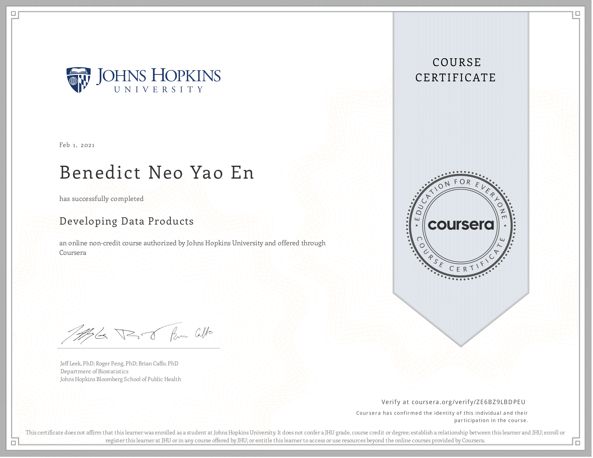

# Course Description
A data product is the production output from a statistical analysis. Data products automate complex analysis tasks or use technology to expand the utility of a data informed model, algorithm or inference. This course covers the basics of creating data products using Shiny, R packages, and interactive graphics. The course will focus on the statistical fundamentals of creating a data product that can be used to tell a story about data to a mass audience.

You will learn how communicate using statistics and statistical products. Emphasis will be paid to communicating uncertainty in statistical results. You will learn how to create simple Shiny web applications and R packages for their data products. In addition, we'll cover reproducible presentations and interactive graphics.

Course content
1. Shiny, rCharts, manipulate, googleVis 
2. Presenting data analysis, slidify, R Studio presenter. 
3. Students creating and deploying their projects 
4. Creating R packages, classes and methods, swirl.

## Articles 

Coming Soon!

## What I've learned

Week 1

I got introduced to the shiny app, how you take the UI.R file and server.R file and use it to form a shiny app. What I got from it was you form inputs from your UI, then in your server file, you take them and do something with them to output it. And in your UI file, you generate the output. It has the idea of ui as a front end, and server as a back end. The basic idea is UI controls the appearance and style, whereas server controls the functions. I also learned about shiny gadgets, where you form small apps in your rstudio and you can interact with it. I also tried out pltoly and the Google Vis api to make amazing plots. I found this course to be pretty old, as shiny has developed quite a lot since then, and doing the projects made me realize that there are better ways to make a shiny app. 

Week 2

This week was about r markdown and leaflet. Leaflet was new to me and I was really amazed how easy it was to create a map using R. the basic idea was to create a make a leaflet object with `leaflet()` then use `addTiles()` to form a basic map, and lastly `addMarkers()` to add points. 

Week 3

I learned about building r packages here. This was a really fun lecture because I always wondered how R packages were made. Important things I learned here were a package must consist of desciption file, R code, documentation and NAMESPACE. I also loved the Roxygen2 syntax that allows you to document your code in the code file itself. 

Week 4

I learned about how to make swirl, there is this package called swirlify that allows you to build a swirl course yourself. Pretty cool.

Project
 
There were a total of 3 projects. The first one was about using the leaflet package, so I decided to plot a map that contained the Starbucks location in the United States. 

The second project was about using the R markdown and plotly to create a presentation. I used the gapminder data and used plotly to animate the GDP and life expectancy relationship over the years

The last project was about creating a shiny app and a reproducible pitch to talk about the presentation. I made a simple covid-19 dashboard with the covid19 package, it was really intuitive to use. I switched up how I create the presentation and used the slidy format instead of the ioslides, and it looked a lot nicer and had a wider form, which was great. 

Overall this course was pretty shallow, would've loved more content about building the shiny app, and then deploying it, possible using docker to containerize. 

## Proof of completion

 

[View it online]()