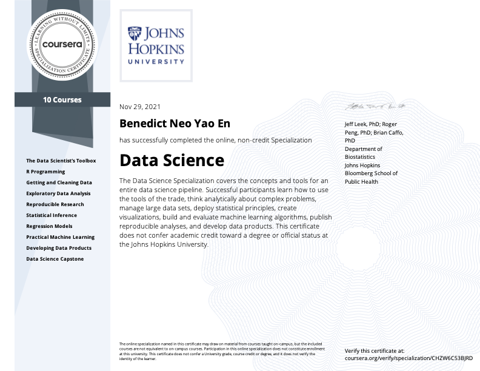

# John Hopkins Data Science Specialization Coursera

Repository for my code for the course [John Hopkins Data Science Specialization](https://www.coursera.org/specializations/jhu-data-science)

## About the specialization

This Specialization covers the concepts and tools you'll need throughout the entire data science pipeline, from asking the right kinds of questions to making inferences and publishing results. In the final Capstone Project, you’ll apply the skills learned by building a data product using real-world data. At completion, students will have a portfolio demonstrating their mastery of the material.

### Specialization courses

This Data Science specialization contains 10 courses and the first five courses are also a part of the Data Science: Foundations using R specialization.

| No  |                                Course Folder                                |   Date Completed    |           Notes           |
| :-: | :-------------------------------------------------------------------------: | :-----------------: | :-----------------------: |
|  1  |            [The Data Scientist's Toolbox](1_DataScienceToolbox)             |  August 29th, 2020  | [Notes](Notes/c1/c1.html) |
|  2  |                       [R Programming](2_Rprogramming)                       | October 19th, 2020  | [Notes](Notes/c2/c2.html) |
|  3  |            [Getting and Cleaning Data](3_Getting%26CleaningData)            | October 31st, 2020  | [Notes](Notes/c3/c3.html) |
|  4  |           [Exploratory Data Analysis](4_ExploratoryDataAnalysis)            | November 12th, 2020 | [Notes](Notes/c4/c4.html) |
|  5  |               [Reproducible Research](5_ReproducibleResearch)               | November 19th, 2020 | [Notes](Notes/c5/c5.html) |
|  6  |               [Statistical Inference](6_StatisticalInference)               | December 17th, 2020 | [Notes](Notes/c6/c6.html) |
|  7  |                    [Regression Model](7_RegressionModel)                    | January 13th, 2021  | [Notes](Notes/c7/c7.html) |
|  8  |          [Practical Machine Learning](8_PracticalMachineLearning)           | January 25th, 2021  | [Notes](Notes/c8/c8.html) |
|  9  |            [Developing Data Products](9_DevelopingDataProducts)             | February 1st, 2021  | [Notes](Notes/c9/c9.html) |
| 10  | [Data Science Capstone](https://github.com/benthecoder/next-word-predictor) | November 28th, 2021 |

## Projects

- R Programming
  - [Air Pollution](2_Rprogramming/Air_pollution) ([html](2_Rprogramming/Air_pollution/AirPollution.html)) ([rpubs](https://rpubs.com/benthecoder/specdata))
  - [Cache Matrix](2_Rprogramming/cache-matrix)
  - [Hospital Ranking](2_Rprogramming/hospital_ranking) ([html](2_Rprogramming/hospital_ranking/hospital_ranking.html)) ([rpubs](https://rpubs.com/benthecoder/hospital-ranking))
- Getting and Cleaning Data
  - [Tidy Data](3_Getting%26CleaningData/tidy_data) ([kaggle](https://www.kaggle.com/benthecoder/getting-and-cleaning-data-with-r))
- Exploratory Data Analysis
  - [Electric Power Consuption EDA](4_ExploratoryDataAnalysis/Project1/) ([kaggle](https://www.kaggle.com/benthecoder/electric-power-consumption-eda-with-ggplotly))
  - [PM2.5 Air pollutant EDA](4_ExploratoryDataAnalysis/Project2/)
- Reproducible Research
  - [Activity Monitoring Analysis](5_ReproducibleResearch/knitr_project1) ([html](5_ReproducibleResearch/knitr_project1/PA1_template.html)) ([rpubs](https://rpubs.com/benthecoder/691112))
  - [Storm Analysis](5_ReproducibleResearch/knitr_project2) ([html](5_ReproducibleResearch/knitr_project2/stormAnalysis.html)) ([rpubs](https://rpubs.com/benthecoder/storm-data-analysis))
- Statistical Inference
  - [Sample vs Theoretical Exponential Distribution](6_StatisticalInference/project) ([html](6_StatisticalInference/project/part_1/Part_1.html)) ([rpubs](https://rpubs.com/benthecoder/expl-distributions)) ([pdf](https://tinyurl.com/stats-inf-part1))
  - [Basic Inference Analysis on ToothGrowth data](6_StatisticalInference/project) ([html](6_StatisticalInference/project/part_2/Part_2.html)) ([rpubs](https://rpubs.com/benthecoder/tooth-growth-inference)) ([pdf](https://tinyurl.com/stats-inf-part2))
- Regression Models
  - [Analysis of College Major by Income](https://www.kaggle.com/benthecoder/analysis-of-college-major-by-income-with-r)
  - [mtcars data regression analysis](7_RegressionModel/project) ([html](/7_RegressionModel/project/mtcars_regression_analysis.html)) ([pdf](https://tinyurl.com/regmods-ben))
- Practical Machine Learning
  - [Human Activity Prediction with Caret](8_PracticalMachineLearning/Final-project/) ([html](/8_PracticalMachineLearning/Final-project/human-activity-prediction.html))
  - [Human Activity Prediction with tidymodels](https://www.kaggle.com/benthecoder/human-activity-data-classification-with-tidymodels)
- Developing Data Products
  - [Starbucks locations in the US](https://rpubs.com/benthecoder/starbucks-us)
  - [GDP and life expectancy Animation with Plotly Presentation](https://rpubs.com/benthecoder/gapminder-plotly)
  - [COVID-19 Dashboard with Shiny](https://benthecoder.shinyapps.io/COVID-19_Dashboard/)
  - [Covid-19 Shiny app Presentation](https://rpubs.com/benthecoder/covid-19-slidy)
  - [Tesla Stock Prediction with ARIMA Presentation](https://rpubs.com/benthecoder/tsla-arima)

## Articles checklist

- [Link](article_list.md)

## Certificates

### Data Science: Foundations using R Specialization

View it online [here](https://coursera.org/share/82097f1d7caeadd28b22d2a7c79724ba)

### Data Science Specialization

View it online [here](https://coursera.org/share/d803065efd7094456cb90036937ad8a6)
