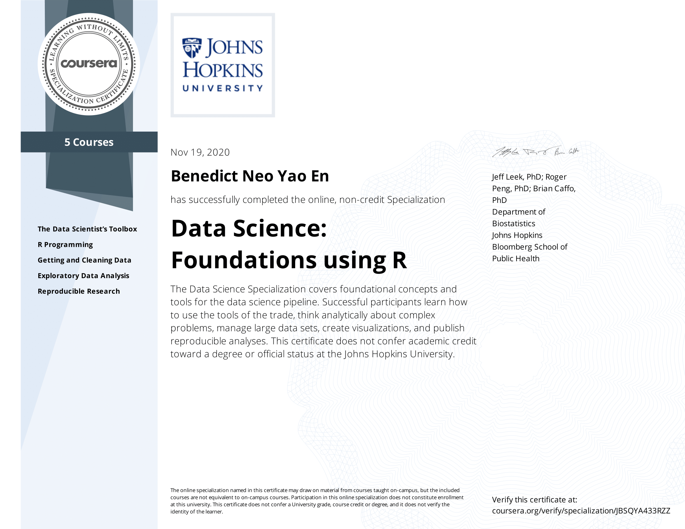

# John Hopkins Data Science Specialization Coursera
Repository for my code for the course [John Hopkins Data Science Specialization](https://www.coursera.org/specializations/jhu-data-science) 

## About the specialization
This Specialization covers the concepts and tools you'll need throughout the entire data science pipeline, from asking the right kinds of questions to making inferences and publishing results. In the final Capstone Project, you’ll apply the skills learned by building a data product using real-world data. At completion, students will have a portfolio demonstrating their mastery of the material.
 

### Specialization courses

This Data Science specialization contains 10 courses and the first five courses are also a part of the Data Science: Foundations using R specialization.

No | Course Folder | Date Completed | Notes 
:---: |:---:  | :---: | :---: 
1 | [The Data Scientist's Toolbox](1_DataScienceToolbox)  | August 29th, 2020 | [Notes](Notes/c1/c1.html)
2 | [R Programming](2_Rprogramming) |  October 19th, 2020 | [Notes](Notes/c2/c2.html)
3 | [Getting and Cleaning Data](3_Getting%26CleaningData) | October 31st, 2020 | [Notes](Notes/c3/c3.html)
4 | [Exploratory Data Analysis](4_ExploratoryDataAnalysis) | November 12th, 2020 | [Notes](Notes/c4/c4.html)
5 | [Reproducible Research](5_ReproducibleResearch)| November 19th, 2020 | [Notes](Notes/c5/c5.html)
6 | [Statistical Inference](6_StatisticalInference) | December 17th, 2020 | [Notes](Notes/c6/c6.html)
7 | [Regression Model](7_RegressionModel) | January 13th, 2021 | [Notes](Notes/c7/c7.html)
8 | [Practical Machine Learning](8_PracticalMachineLearning) | January 25th, 2021 | [Notes](Notes/c8/c8.html) 
9 | [Developing Data Products](9_DevelopingDataProducts) | Goal: January 30rd, 2021 | [Notes](Notes/c9/c9.html)
10| Data Science Capstone | Goal: February 20rd, 2021 | -

##  Projects

* R Programming
  - [Air Pollution](2_Rprogramming/Air_pollution) ([html](2_Rprogramming/Air_pollution/AirPollution.html)) ([rpubs](https://rpubs.com/benthecoder/specdata)) 
  - [Cache Matrix](2_Rprogramming/cache-matrix)
  - [Hospital Ranking](2_Rprogramming/hospital_ranking) ([html](2_Rprogramming/hospital_ranking/hospital_ranking.html)) ([rpubs](https://rpubs.com/benthecoder/hospital-ranking)) 
* Getting and Cleaning Data
  - [Tidy Data](3_Getting%26CleaningData/tidy_data)
* Exploratory Data Analysis
  - [Electric Power Consuption EDA](4_ExploratoryDataAnalysis/Project1/)
  - [PM2.5 Air pollutant EDA](4_ExploratoryDataAnalysis/Project2/)
* Reproducible Research
  - [Activity Monitoring Analysis](5_ReproducibleResearch/knitr_project1) ([html](5_ReproducibleResearch/knitr_project1/PA1_template.html)) ([rpubs](https://rpubs.com/benthecoder/691112))
  - [Storm Analysis](5_ReproducibleResearch/knitr_project2) ([html](5_ReproducibleResearch/knitr_project2/stormAnalysis.html)) ([rpubs](https://rpubs.com/benthecoder/storm-data-analysis))
* Statistical Inference
  - [Sample vs Theoretical Exponential Distribution](6_StatisticalInference/project) ([html](6_StatisticalInference/project/part_1/Part_1.html)) ([rpubs](https://rpubs.com/benthecoder/expl-distributions)) ([pdf](https://tinyurl.com/stats-inf-part1))
  - [Basic Inference Analysis on ToothGrowth data](6_StatisticalInference/project) ([html](6_StatisticalInference/project/part_2/Part_2.html)) ([rpubs](https://rpubs.com/benthecoder/tooth-growth-inference)) ([pdf](https://tinyurl.com/stats-inf-part2))
* Regression Models 
  - [Analysis of College Major by Income](https://www.kaggle.com/benthecoder/analysis-of-college-major-by-income-with-r)
  - [mtcars data regression analysis](7_RegressionModel/project) ([html](/7_RegressionModel/project/mtcars_regression_analysis.html)) ([pdf](https://tinyurl.com/regmods-ben))
* Practical Machine Learning
  - [Human Activity Prediction with Caret](8_PracticalMachineLearning/Final-project/) ([html](/8_PracticalMachineLearning/Final-project/human-activity-prediction.html))
* Developing Data Products
  - [Starbucks locations in the US](https://rpubs.com/benthecoder/starbucks-us)
  - [GDP and life expectancy Animation with Plotly](https://rpubs.com/benthecoder/gapminder-plotly)
  - [Swirl in Shiny app]()
  - [Reproducible Presentation]() 

## Articles checklist

* [Link](article_list.md)

---

## Resources 

### Official repo and notes
* [DS Specialization github repo](https://github.com/DataScienceSpecialization/courses)
* [DS Specialization github io](http://datasciencespecialization.github.io)
* [Data Science Specialization Course Notes by Xing Su](http://sux13.github.io/DataScienceSpCourseNotes/)

### Cheatsheets

#### R
* [RStudio cheatsheets](https://rstudio.com/resources/cheatsheets/)
* [RStudio::conf 2019 cheatsheets](https://rstudio.com/wp-content/uploads/2019/01/Cheatsheets_2019.pdf)

#### Data Viz
* [R Graph Gallery](https://www.r-graph-gallery.com)
* [from Data to Viz](https://www.data-to-viz.com) 

#### Data Science
* [data-science-cheetsheet](https://github.com/ml874/Data-Science-Cheatsheet/blob/master/data-science-cheatsheet.pdf) 

#### Machine Learning
* [Machine Learning tips and tricks cheatsheet](https://stanford.edu/~shervine/teaching/cs-229/cheatsheet-machine-learning-tips-and-tricks)
* [Super VIP cheatsheet](https://sgfin.github.io/files/cheatsheets/cs229_2018_cheatsheet.pdf)
* [ML glossary](https://ml-cheatsheet.readthedocs.io/en/latest/index.html)

#### Statistics & Probability
* [Probability Cheatsheet](https://tinyurl.com/prob-cheatsheet)
* [Seeing Theory](https://seeing-theory.brown.edu/index.html)
* [mit stats](https://web.mit.edu/~csvoss/Public/usabo/stats_handout.pdf)
* [harvard stats](https://tinyurl.com/harvard-stats)
* [stanford](https://stanford.edu/~shervine/teaching/cme-106/cheatsheet-statistics)
* [Quick-R](https://www.statmethods.net)

#### Linear Algebra
* [Linear Algebra Review and Reference](https://www.cs.cmu.edu/~zkolter/course/15-884/linalg-review.pdf)
* [Berkeley Linear Algebra Cheatsheet](https://math.berkeley.edu/~peyam/Math54Fa11/Cheat%20Sheets/Cheat%20Sheet%20(tiny%20font,%20no%20margins).pdf)
* [Intro to Linear Algebra for Applied ML w Python](https://pabloinsente.github.io/intro-linear-algebra)

### Books

#### From the course
* [R for Data Science](https://r4ds.had.co.nz)
* [R Programming for Data Science](https://bookdown.org/rdpeng/rprogdatascience/)
* [Exploratory Data Analysis with R](https://bookdown.org/rdpeng/exdata/)
* [Report Writing for Data Science in R](https://leanpub.com/reportwriting)
* [Statistical Inference for Data Science](https://leanpub.com/LittleInferenceBook/read)
* [Regression models for Data Science in R](https://leanpub.com/regmods/read)
* [The Caret Package](https://topepo.github.io/caret/index.html)
* [Developing Data Products in R](https://seankross.com/developing-data-products/)

#### Beginner
* [An Introduction to R](https://intro2r.com)
* [Big Book of R](https://www.bigbookofr.com/index.html)
* [Hands-on Programming with R](https://rstudio-education.github.io/hopr/)
* [The Tidynomicon](https://gvwilson.github.io/tidynomicon/)
* [R Graphics Cookbook, 2nd edition](https://r-graphics.org)

#### Advanced
* [Advanced R, 2nd edition](https://adv-r.hadley.nz)
* [Efficient R programming](https://csgillespie.github.io/efficientR/)

#### Data Science
* [Introduction to Data Science, Data Analysis and Prediction Algorithms with R](https://rafalab.github.io/dsbook/)
* [Data Science Live Book](https://livebook.datascienceheroes.com)
* [Practical Data Science with R](http://1.droppdf.com/files/EyDuc/manning-practical-data-science-with-r-2014.pdf)
* [Data Skills for Reproducible Science](https://psyteachr.github.io/msc-data-skills/)
* [Tidyverse Skills for Data Science](https://jhudatascience.org/tidyversecourse/)
* [Advanced Data Science 2020](http://jtleek.com/ads2020/)
* [Modern Data Science with R](https://mdsr-book.github.io/mdsr2e/)

#### Statistic / Statistical Learning
* [Introduction to Statistical Learning](https://statlearning.com)
* [Statistical Inference via Data Science: A ModernDive into R and the tidyverse](https://moderndive.com)
* [R For Statistical Learning](https://daviddalpiaz.github.io/r4sl/)
* [Statistical rethinking with brms, ggplot2, and the tidyverse: Second edition](https://bookdown.org/content/4857/)
* [Modern Statistics with R](http://modernstatisticswithr.com/)

#### Machine Learning
* [Machine Learning](https://m-clark.github.io/introduction-to-machine-learning/)
* [Hands-On Machine Learning with R](https://bradleyboehmke.github.io/HOML/)
* [Interpretable Machine Learning](https://christophm.github.io/interpretable-ml-book/)
* [Advanced Statistical Computing](https://bookdown.org/rdpeng/advstatcomp/)
* [Tidy Modeling with R](https://www.tmwr.org)
* [Applied predictive Model](https://tinyurl.com/applied-predictive-model)

#### Supplementary 
* [R Markdown: The Definitive Guide](https://bookdown.org/yihui/rmarkdown/)
* [Mastering Shiny](https://mastering-shiny.org/index.html)
* [ggplot2: Elegant Graphics for Data Analysis](https://ggplot2-book.org/index.html)
* [Text Mining with R](https://www.tidytextmining.com)
* [blogdown](https://bookdown.org/yihui/blogdown/)
* [R Packages](https://r-pkgs.org/index.html)

### College Classes
* [Stats191 Intro to Applied Stats, Harvard](https://web.stanford.edu/class/stats191/#)

### Fun Projects
* [Tidy Tuesday](https://github.com/rfordatascience/tidytuesday) ([Article](https://thomasmock.netlify.app/post/tidytuesday-a-weekly-social-data-project-in-r/))

### Podcasts
* [Not So Standard Deviation](https://nssdeviations.com)

### Blogs
* [R bloggers](https://www.r-bloggers.com)
* [Simply Statistics](https://simplystatistics.org)
* [RStudio Blog](https://blog.rstudio.com)
* [r4 stats](r4stats.com)
* [Variance Explained](http://varianceexplained.org/posts/)
* [Data imaginist](https://www.data-imaginist.com)
* [Probably Overthinking it](https://www.allendowney.com/blog/)
* [Yihui's Blog](https://yihui.org/en/)
* [Julia Silge](https://juliasilge.com/blog/)
* [Vicki Boykis](https://veekaybee.github.io/)

### Twitter accounts

* [RStudio](https://twitter.com/rstudio)
* [RStudio Tips](https://twitter.com/rstudiotips)
* [One R Tip a Day](https://twitter.com/RLangTip)
* [Roger D. Peng](https://twitter.com/rdpeng)
* [Hadley Wickham](https://twitter.com/hadleywickham)
* [Mine Çetinkaya-Rundel](https://twitter.com/minebocek)
* [Thomas Lin Pedersen](https://twitter.com/thomasp85)
* [Nathan Yao](https://twitter.com/flowingdata)

---

## Certificates

### Data Science: Foundations using R Specialization

 

View it online [here](https://coursera.org/share/82097f1d7caeadd28b22d2a7c79724ba)

### Data Science Specialization

* To be completed
